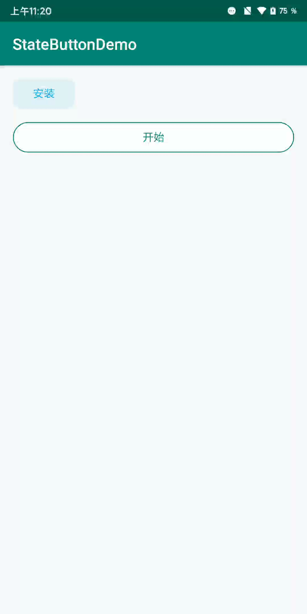

# StatesButton

这是一个为解决按钮多状态UI问题而写的可轻松切换状态UI控件。我们在写项目中难免会遇到应用下载等多状态UI情况，如何方便、快捷、易维护、易扩展、可复用控件UI、可自由组合控件UI，也成为了我们比较关心的事情，所以此控件也由此产生。

该控件具有以下优势：

- 只提供按钮UI的容器。具体UI显示可通过Builder自定义；
- 易扩展。按钮状态UI可拆分、自由组合、被其他StatesButton复用；
- 按钮状态切换、获取简单；
- 代码行数较少，轻量级开发；
- 界面异常，自动保存状态与恢复；

体验Demo下载： <a href="material/StatesButtonDemo-debug.apk" target="_blank">单击此处下载</a>

Demo预览 ：

 

## 如何使用？

